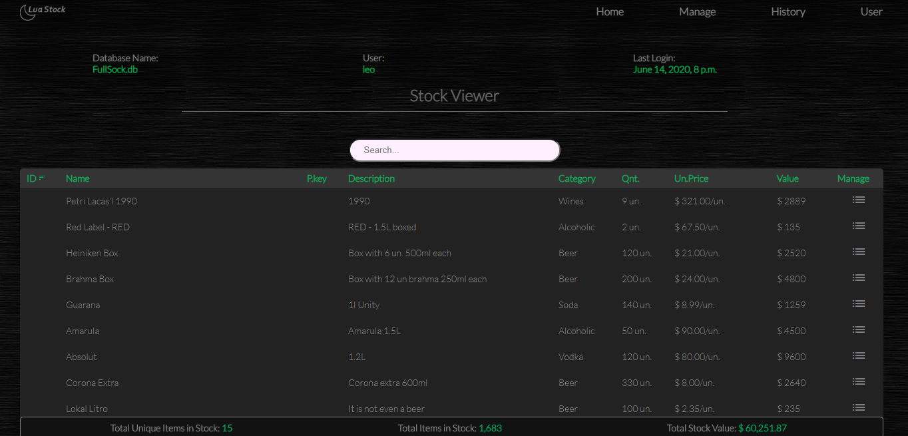
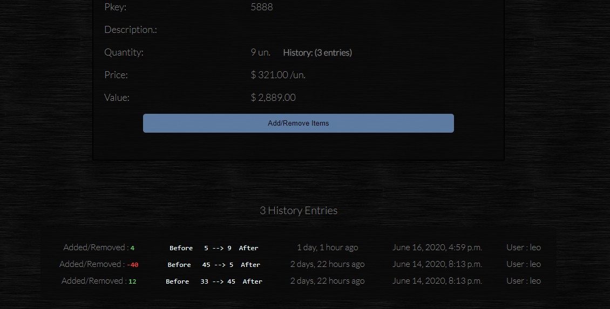
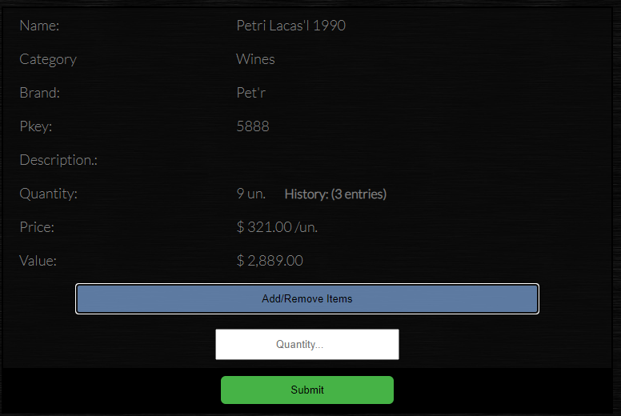
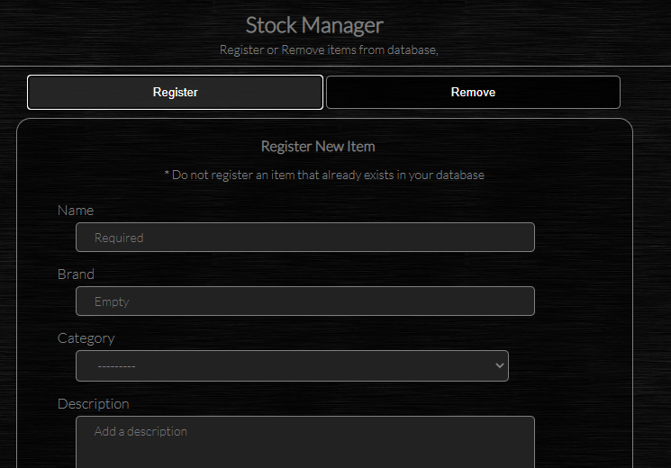
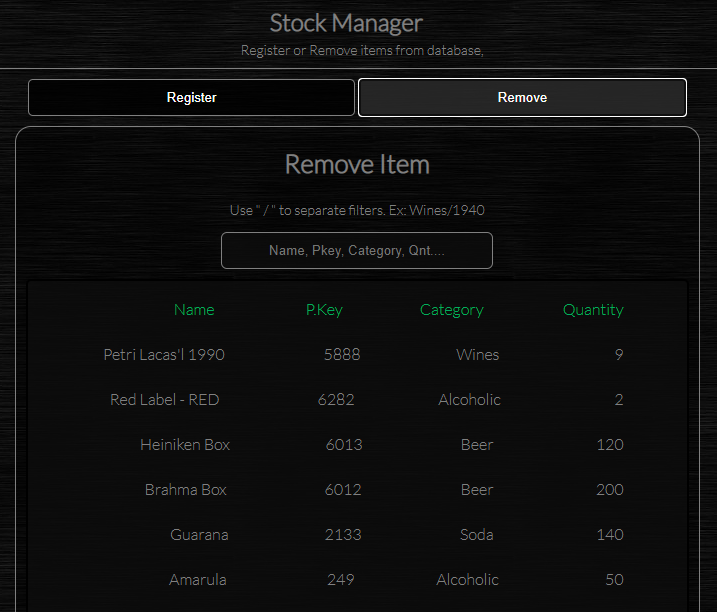
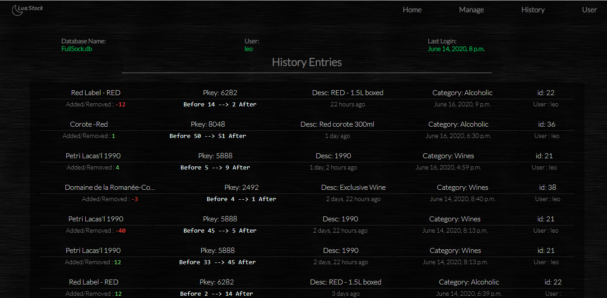
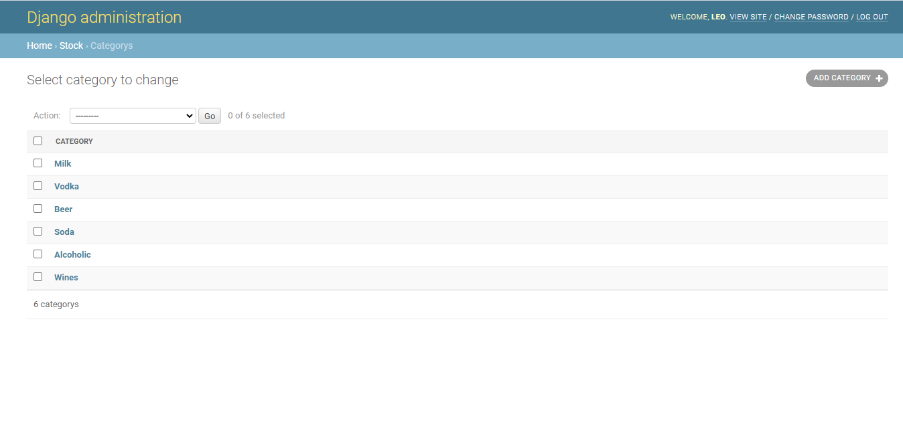

# Stock Management

#### Status: This project isn't finished yet. Link to Simple Apresentation <a href="https://leonardo8133.github.io/stock_manage/"> Click </a>

### A Stock management web application where you can add, remove, edit and save products into a database.

##### This application has a User System that allow website admin to choose who can view, edit or manage the products.

##### Each product have his own history that can be viewed in product detail or History Tab.

### You can add or items to a product for stock control.

### You Add or Remove Products

### View the Complete History

### And finally... Manage the Product Categories and Everything in you database through django admin page.

<ul>
  <li>Default Admin user:</li>
  <li>Username: admin</li>
  <li>Password: admin</li>
</ul>

### Installation

<ul>
  <li>Just install django and python</li>
  <li>Execute runserver.exe</li>
  <li>Acess the application in LocalHost URL (http://127.0.0.1:8000/stock/)</li>
 </ul>
