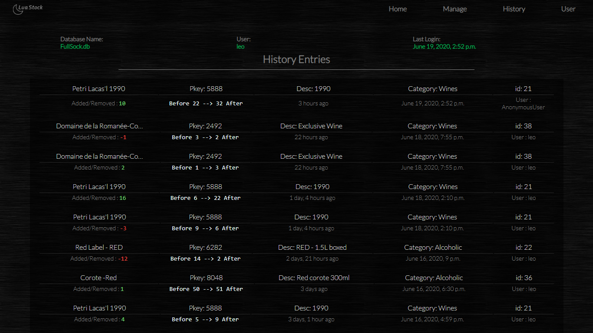

# Stock Management
#### Link to the Web Apresentation <a href="https://leonardo8133.github.io/stock_manage/"> Click Here </a>

#### A stock management web application where you can add, remove, edit, and save products into a database.

This application has a User System that allows the website admin to choose who can view, edit, or manage the products.

 Each product has its own history that can be viewed in product detail or History Tab.

### You can add or remove items in a product.

### You can add or remove products

### View of the complete history.

### Manage the product categories and everything in your database through the Django admin page.

### Installation
 The project already comes with an SQLite database, so you just need to create a virtual environment, install the requirements.txt and runserver.
